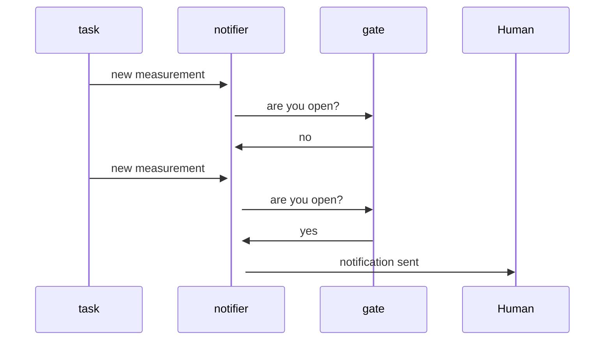

# Flaming Zombies

A simple, lightweight monitoring daemon for performing checks, detecting failure and raising alerts.

---

THIS IS STILL A WORK IN PROGRESS

---

Flaming Zombies ties together three components with three distinct responsibilities; `tasks`, `notifiers` and `gates`.

* [`tasks`](libexec/task) check whether a condition is true or false, like if a host responds to pings?
* [`notifiers`](libexec/notifier) raise alerts.
* [`gates`](libexec/gate) control when a `notifier` may execute.



You're expected to have many tasks. Each task can have one or more notifiers. Each notifier can have one or more gates.

And that is the basis of Flaming Zombies.

## Documentation

The complete documentation is available in the [man pages](./man). You can read them in your shell before they're installed using using the command:

```
curl https://raw.githubusercontent.com/jonhiggs/flamingzombies/master/man/man1/fz.1 | man /dev/stdin
```

## Features

* Made to be used at the command line.
* Configured with flat files.
* Completely documented in man pages.
* Few dependencies.
* Very easy to extend, and customise.
* Liberal 2-clause BSD license.

## Building

Before you can build `fz` and `fzctl`, you'll need to have [Go](https://go.dev/doc/install) installed on your system.

To build, run:

```
go build ./cmd/fzctl/fzctl.go
go build ./cmd/fz/fz.go
```

That will produce the binaries for your system. The plugins are at `./libexec` and the man pages are at `./man`. Adapting the OpenBSD installation instructions should get you a long way to installing it on most UNIX-like system. You may find an init script for your operating system at `./scripts`. If you end up writing one, I would appreciate it if you could share it back.


## Installation

Installation is intended to be very simple. Eventually, I'd like to provide installation packages, but until then a manual process will need to suffice.

### OpenBSD

The below sequence of commands will install the daemon on OpenBSD:

```sh
## fz
wget https://github.com/jonhiggs/flamingzombies/releases/download/${VERSION}/fz_openbsd_${ARCH} \
    -O /usr/local/bin/fz

chown root:wheel /usr/local/bin/fz
chmod 755 /usr/local/bin/fz

## fzctl
wget https://github.com/jonhiggs/flamingzombies/releases/download/${VERSION}/fzctl_openbsd_${ARCH} \
    -O /usr/local/bin/fzctl

chown root:wheel /usr/local/bin/fzctl
chmod 755 /usr/local/bin/fzctl

## rc script
wget https://raw.githubusercontent.com/jonhiggs/flamingzombies/master/scripts/openbsd_rc \
    -O /etc/rc.d/flamingzombies

chown root:wheel /etc/rc.d/flamingzombies
chmod 755 /etc/rc.d/flamingzombies

## plugins
wget https://github.com/jonhiggs/flamingzombies/releases/download/${VERSION}/plugins.tar.gz \
    -O /tmp/plugins.tar.gz

tar -C /usr/local/libexec -zxvf /tmp/plugins.tar.gz
rm /tmp/plugins.tar.gz

## man pages
for m in man1/fz.1 man1/fzctl.1 man5/flamingzombies.toml.5 man7/fz-gates.7 man7/fz-notifiers.7 man7/fz-tasks.7; do
    wget https://raw.githubusercontent.com/jonhiggs/flamingzombies/master/man/$f \
        -O /usr/local/man/$f
done

## config
# create a configuration at /etc/flamingzombies.toml
# see the flamingzombies.toml(5) man page.

## enable the daemon
rcctl enable flamingzombies
rcctl set flamingzombies logger daemon.info
```
